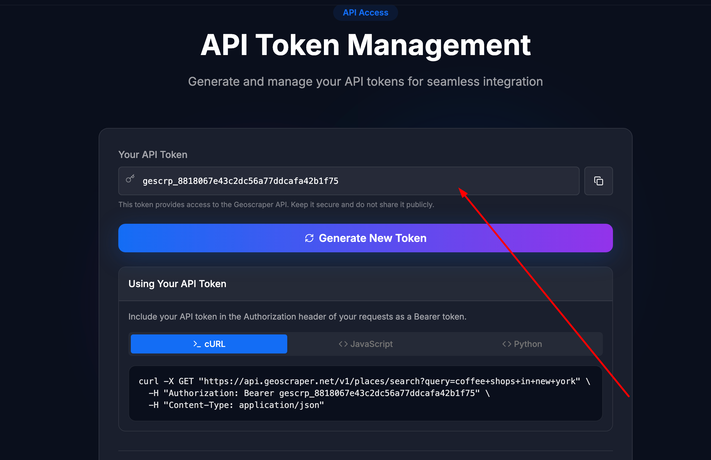
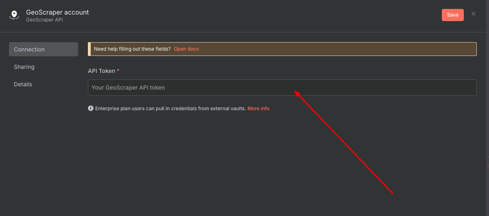
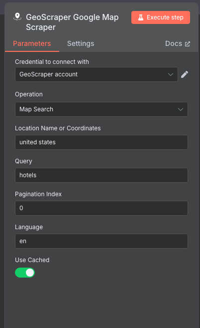
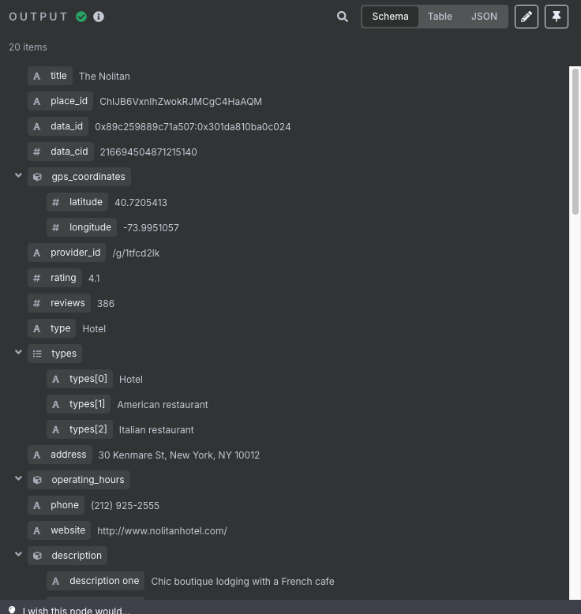
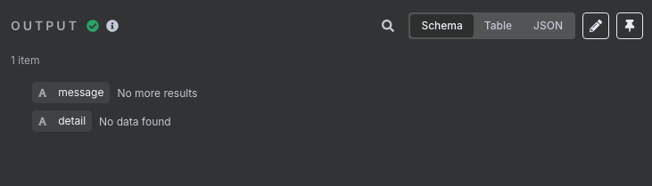
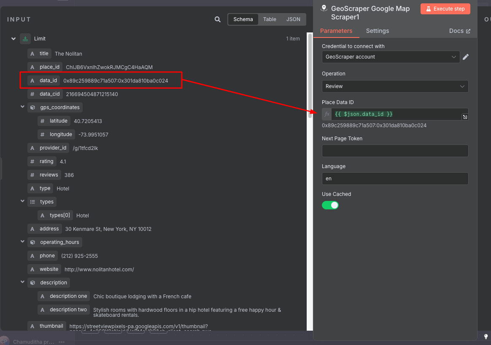

[](https://www.npmjs.com/package/@two02/n8n-nodes-google-maps-scraper)

# n8n-nodes-geoscraper

This is an n8n community node for Google Maps scraping, including places, reviews, and auto-search functionality.

## Package

You can install this node from npm:

[https://www.npmjs.com/package/@two02/n8n-nodes-google-maps-scraper](https://www.npmjs.com/package/@two02/n8n-nodes-google-maps-scraper)

```
npm install @two02/n8n-nodes-google-maps-scraper
```

Geoscraper is a powerful tool for scraping Google Maps data, including reviews, search results, and auto search suggestions. It requires a Pro plan to access the API, but you can start with a free trial before paying. Obtain your API token by visiting [https://geoscraper.net/api](https://geoscraper.net/api). Use this node to access n8n's Google Maps scraper capabilities.

[n8n](https://n8n.io/) is a [fair-code licensed](https://docs.n8n.io/reference/license/) workflow automation platform.

[Installation](#installation)  
[Operations](#operations)  
[Credentials](#credentials)  
[Compatibility](#compatibility)  
[Usage](#usage)  
[Resources](#resources)  
[Version history](#version-history)  

## Installation

Follow the [installation guide](https://docs.n8n.io/integrations/community-nodes/installation/) in the n8n community nodes documentation.

## Operations

This node supports the following operations:

- Scrape Google Maps reviews
- Scrape Google Maps results
- Scrape Google Maps auto search suggestions

## Credentials

To use this node, you need a Geoscraper API token. You can get a token by signing up for a free trial or Pro plan at [https://geoscraper.net/api](https://geoscraper.net/api). After signing up, copy your API token and add it to the node's credentials in n8n.

---

🚀 **Special Promotion!** 🚀

**Use the code `N8N` to get a 35% lifetime discount on your Geoscraper subscription!**

---

## Unlimited Scraping Offer

💡 **We offer unlimited scraping for a fixed monthly price — no pay-per-use charges!**

Enjoy predictable costs and scrape as much as you need with your subscription.

---

## Compatibility

- Minimum n8n version: 1.95.3
- Tested with: 1.95.3
- Known issues: None

## Usage

To automate the extraction of Google Maps data for your business or research needs, follow these steps to get started:

### How to Get Your GeoScraper API Token

1. Go to [https://geoscraper.net/api](https://geoscraper.net/api).
2. Log in or sign up for a free trial or Pro plan.
3. Once logged in, you will see your API token on the dashboard. See the example below:

   

4. Copy the API token.
5. In n8n, add a new credential for the GeoScraper node and paste your API token into the appropriate field. See the example below:

   

Now you can use this node to automate Google Maps scraping in your workflows.

For more details on how to use the node, refer to the n8n documentation or the Geoscraper API docs.

### Map Search

Use the **Map Search** operation to find places on Google Maps by location and query.

- You can enter either a location name (e.g., "New York") or geographic coordinates (e.g., "40.7128,-74.0060").
- Add your search query (e.g., "coffee shop").
- Specify the page number you want to retrieve results from.

See the example below:



#### Example Output

Once you have run the operation, you will get an output like this:



If no data is found, you will see a message like this:



### Review

Use the **Review** operation to gather reviews from Google Maps for a specific place.

- First, obtain the Place Data ID from a previous Map Search operation.
- Enter the Place Data ID into the Review operation to fetch reviews for that location.

See the example below:



#### Fetching Additional Pages

If there are more reviews available, the response will include a `next_page_token`. Use this token in the Review operation to fetch the next page of reviews.

See the example below:


## Resources

* [n8n community nodes documentation](https://docs.n8n.io/integrations/#community-nodes)
* [Geoscraper API documentation](https://geoscraper.net/api)

## Version history

- v1.0.0: Initial release with support for Google Maps reviews, results, and auto search scraping.
